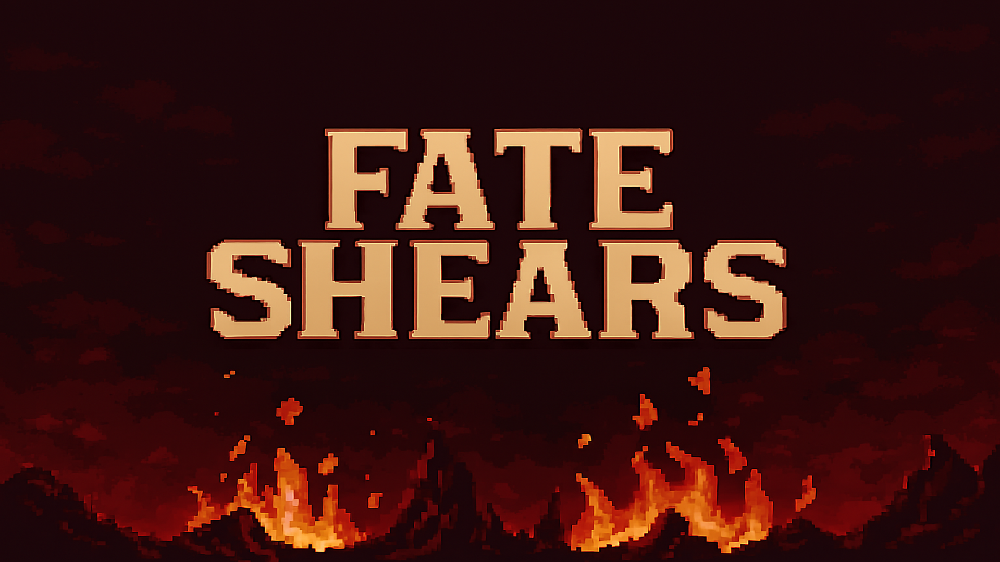

# Fate Shears

그림자 능력을 사용하는 주인공의 2D 액션 게임 제작에 참여했음.

- 기간: 2025.09 ~ 2025.11
- 구분: 2025 GBGC 게임출시 협업 팀 프로젝트
- 담당: 게임 기획, 플레이어 기능 일부 구현
- 기술: Unity, C#
- 원본 저장소: [GBGC1/Fate_Shears](https://github.com/GBGC1/Fate_Shears)
- 팀 공개 페이지: [Fate Shears itch.io](https://ggor.itch.io/fate-shears)

## 플레이와 빌드

- [itch.io 페이지](https://ggor.itch.io/fate-shears)에서 Windows 빌드를 내려받을 수 있음.
- 좌우 방향키로 이동하고 `A` 공격, `C` 그림자 변신, `I` 인벤토리, `K` 능력창을 사용함.

## 내가 맡은 부분과 구현 방식

- `PlayerShadowController`에서 평상시와 그림자 상태를 오가는 변신 기능을 구현했음.
- `FatigueSystem`에서 그림자 상태의 피로도 증가와 회복을 관리했음.
- HP와 피로도 변화 이벤트를 UI에 연결해 게이지가 바로 갱신되게 했음.
- 그림자 조각 수와 사용할 수 있는 능력을 보여주는 UI를 작업했음.
- 능력창을 정리하고 B3 구역의 맵 틀을 제작했음.

| 만든 기능 | 구현 내용 |
| --- | --- |
| 그림자 변신 | 평상시와 그림자 상태를 전환하도록 만들었음 |
| 피로도 | 그림자 상태에서 증가하고 해제하면 회복되게 했음 |
| 상태 UI | HP, 피로도와 그림자 조각 변화가 바로 보이게 연결했음 |
| B3 맵 | 플레이할 수 있는 구역의 기본 틀을 제작했음 |

## 협업 방식

- 기능별 브랜치에서 작업한 뒤 PR로 합쳤음.
- 기획과 프로그래밍을 함께 맡아 기능이 실제 플레이에 맞는지 확인했음.

## 현재 상태

- 이 저장소는 팀 프로젝트에서 내가 작업한 내용을 확인하기 위한 포크임.
- 개인 작업은 `yumin-beep` 커밋에서 확인할 수 있음.
